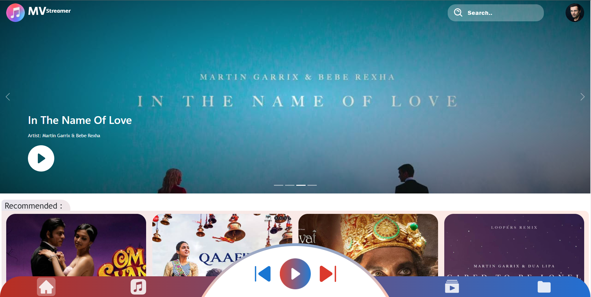
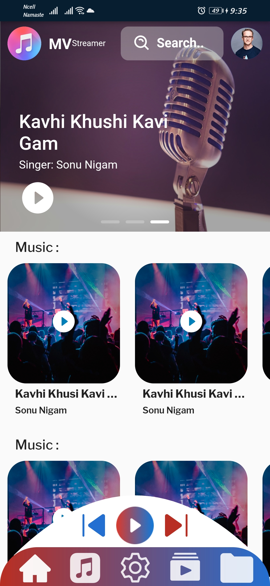
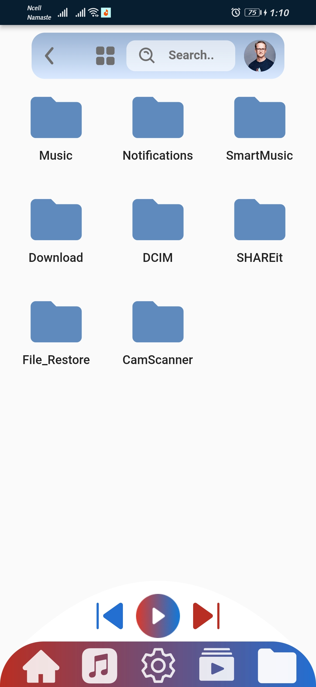

<div align="center">

[<h1 style="font-size:60px; width:100%;">MVstreamer</h1>](./appicon.png)

# 🖥️Music/Video Streaming App🖥️

</div>

## Technology Use:
1. ReactJs
2. NodeJs 
3. MongoDB (To store auth userDetail)
4. Firebase (To store images, files)
5. Flutter


## UI :
### Home Page :
[</img>](interface/Home_Page.png)
### Video Streamer Page :
[</img>](interface/VideoPlayer.png)
### Music Streamer Page:
[</img>](interface/MusicPlayer_Page.png)
### Local File Page:
[</img>](interface/Local_Page.png)

### Flutter Application:

[</img>](interface/mobile_home_page.jpg)
[</img>](interface/mobile_musicPlayer.jpg)
[</img>](interface/mobile_videoPlayer.jpg)
[</img>](interface/mobile_local_screen.jpg)
[</img>](interface/mobile_signIn_screen.jpg)

<br/>

[<p style="font-size:50px;">Todo</p>](todo.md "Todo")

## How to run Locally:
### NOTE: Firstly you need to install Node.js, Flutter in you local computer

### API:
1. Directory: `MVstreamer`
2. Create `.env` file in Root Directory
3. Get all the environment variables which are include in `.env.example`
4. Get Firebase SDK Service Account Key & Connect MongoDB
5. Run `npm install --global yarn` to install yarn
4. Run `npm install -g nodemon` to install nodemon
5. Run `yarn` to install all packages
6. Run `yarn start` to run the server

### React:
1. Directory: `Mvstreamer/client/web`
2. create `.env` file and add variable value included in `.env.example`
3. Run `yarn` to install all packages
4. Run `yarn start` to run the server

### Flutter:
1. Directory `MVstreamer/client/mobile`
2. Create `.env` file in Root Directory
3. Get all the environment variables which are include in `.env.example`
4. create `Info.plist` file inside `ios/Runner/` and copy given peace of code bellow
5. create Firebase app for android and ios google auth and download `google-services.json` & `GoogleServices-info.plist` and copy inside `android/app` & `./ios`
6. inside `ios/Runner/info.plist` change this line of code:
7. ```xml
   <array>
			<!-- Copied from GoogleService-Info.plist key REVERSED_CLIENT_ID -->
			<string>com.googleusercontent.apps.</string>
		</array>
    ```
7. create developer Facebook application and create `strings.xml` file inside `android/app/src/main/res/values` and copy this peace of code inside `strings.xml` and copy all the required value from developer facebook
8. ```xml
	<?xml version="1.0" encoding="utf-8"?>
	<resources>	
	<string name="facebook_app_id">1234</string>
	<string name="fb_login_protocol_scheme">fb1234</string>
	<string name="facebook_client_token">56789</string>
	<string name="app_name">app_name</string>
	</resources>
	```
9.  inside `ios/Runner/info.plist` change this like of code with your own value :
10. ```xml
	<key>CFBundleURLTypes</key>
	<array>
	<dict>
	<key>CFBundleURLSchemes</key>
	<array>
		<string>fbAPP-ID</string>
	</array>
	</dict>
	</array>
	<key>FacebookAppID</key>
	<string>APP-ID</string>
	<key>FacebookClientToken</key>
	<string>CLIENT-TOKEN</string>
	<key>FacebookDisplayName</key>
	<string>APP-NAME</string>
	```
10. Run `flutter run` 


### Info.plist
```xml
	<?xml version="1.0" encoding="UTF-8"?>
	<!DOCTYPE plist PUBLIC "-//Apple//DTD PLIST 1.0//EN" "http://www.apple.com/DTDs/PropertyList-1.0.dtd">
	<plist version="1.0">
	<dict>
		<key>CFBundleDevelopmentRegion</key>
		<string>$(DEVELOPMENT_LANGUAGE)</string>
		<key>CFBundleDisplayName</key>
		<string>Android Ios</string>
		<key>CFBundleExecutable</key>
		<string>$(EXECUTABLE_NAME)</string>
		<key>CFBundleIdentifier</key>
		<string>com.mvstreamer.env</string>
		<key>CFBundleInfoDictionaryVersion</key>
		<string>6.0</string>
		<key>CFBundleName</key>
		<string>MVstreamer</string>
		<key>CFBundlePackageType</key>
		<string>APPL</string>
		<key>CFBundleShortVersionString</key>
		<string>$(FLUTTER_BUILD_NAME)</string>
		<key>CFBundleSignature</key>
		<string>????</string>
		<key>CFBundleVersion</key>
		<string>$(FLUTTER_BUILD_NUMBER)</string>
		<key>LSRequiresIPhoneOS</key>
		<true/>
		<key>UILaunchStoryboardName</key>
		<string>LaunchScreen</string>
		<key>UIMainStoryboardFile</key>
		<string>Main</string>
		<key>UISupportedInterfaceOrientations</key>
		<array>
			<string>UIInterfaceOrientationPortrait</string>
			<string>UIInterfaceOrientationLandscapeLeft</string>
			<string>UIInterfaceOrientationLandscapeRight</string>
		</array>
		<key>UISupportedInterfaceOrientations~ipad</key>
		<array>
			<string>UIInterfaceOrientationPortrait</string>
			<string>UIInterfaceOrientationPortraitUpsideDown</string>
			<string>UIInterfaceOrientationLandscapeLeft</string>
			<string>UIInterfaceOrientationLandscapeRight</string>
		</array>
		<key>CFBundleURLTypes</key>
	<array>
		<dict>
			<key>CFBundleTypeRole</key>
			<string>Editor</string>
			<key>CFBundleURLSchemes</key>

			<array>
				<!-- TODO Replace this value: -->
				<!-- Copied from GoogleService-Info.plist key REVERSED_CLIENT_ID -->
				<string>com.googleusercontent.apps</string>
			</array>
		</dict>
	</array>
		<key>UIViewControllerBasedStatusBarAppearance</key>
		<true/>
		<key>NSPhotoLibraryUsageDescription</key>
		<string>This app needs to use Photos</string>

		<key>CFBundleURLTypes</key>
		<array>
		<dict>
		<key>CFBundleURLSchemes</key>
		<array>
			<string>fbAPP-ID</string>
		</array>
		</dict>
		</array>
		<key>FacebookAppID</key>
		<string>APP-ID</string>
		<key>FacebookClientToken</key>
		<string>CLIENT-TOKEN</string>
		<key>FacebookDisplayName</key>
		<string>APP-NAME</string>
	</dict>
	</plist>
```
