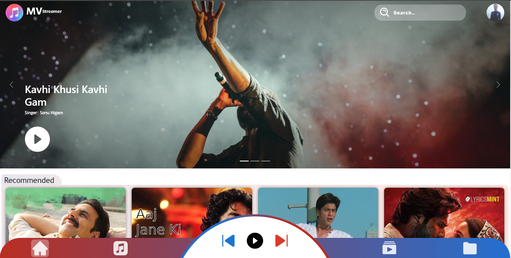
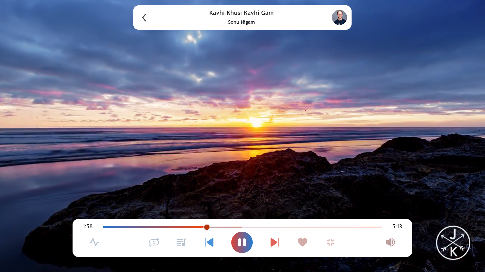
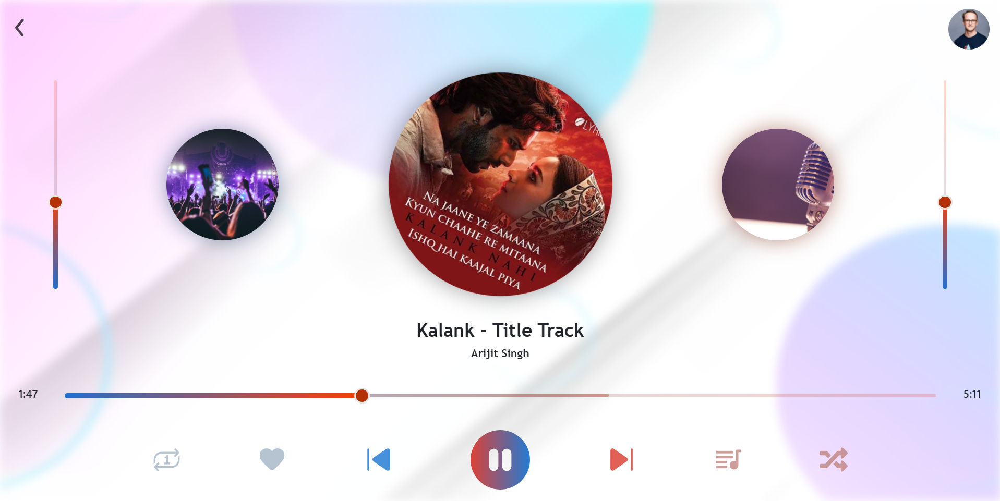
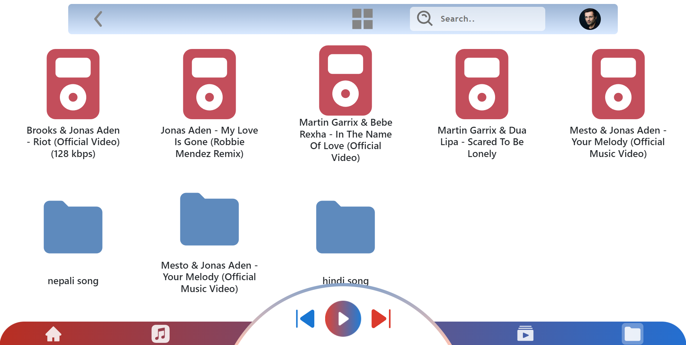
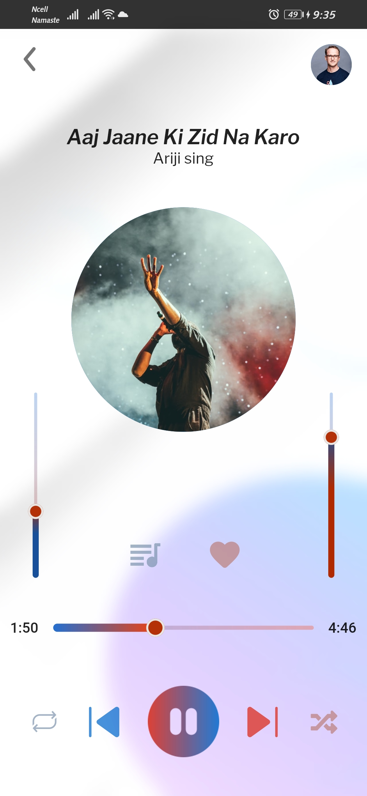
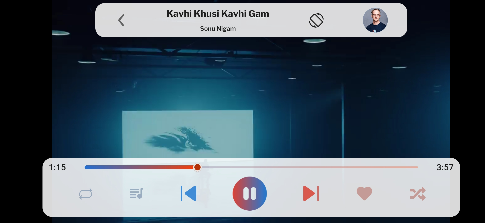
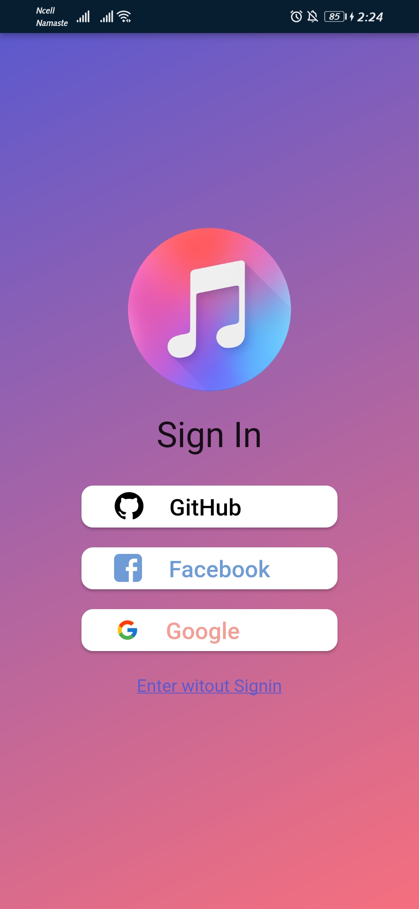

[<h1 style="font-size:60px; width:100%;">MVstreamer </h1>](./appicon.png)
## Streaming App Using:
1. ReactJs
2. NodeJs 
3. MongoDB (To store auth userDetail)
4. Firebase (To store images, files)
5. Flutter

## UI :
### Home Page :
[</img>](design/Home_Page.png)
### Video Streamer Page :
[</img>](design/VideoPlayer.png)
### Music Streamer Page:
[</img>](design/MusicPlayer_Page.png)
### Local File Page:
[</img>](design/Local_Page.png)

### Flutter Application:

[</img>](design/mobile_home_page.jpg)
[</img>](design/mobile_musicPlayer.jpg)
[</img>](design/mobile_videoPlayer.jpg)
[</img>](design/mobile_local_screen.jpg)
[</img>](design/mobile_signIn_screen.jpg)

 

[
Todo
](todo.md "Todo")

## How to run Locally:

### API:
1. `MVstreamer`
2. Create .env file in Root Directory
3. Get all the environment variables which are include in .env.example
4. Get Firebase SDK Service Account Key & Connect MongoDB
5. Run `npm start` to run the server

### React:
1. `Mvstreamer/client/web`
2. create '.env' file and add variable value included in '.env.example'
3. Run `npm install` to install all packages
4. Run `npm start` to run the server

### Flutter:
1. `MVstreamer/client/mobile`
2. Create .env file in Root Directory
3. Get all the environment variables which are include in .env.example
4. Run `flutter run` 